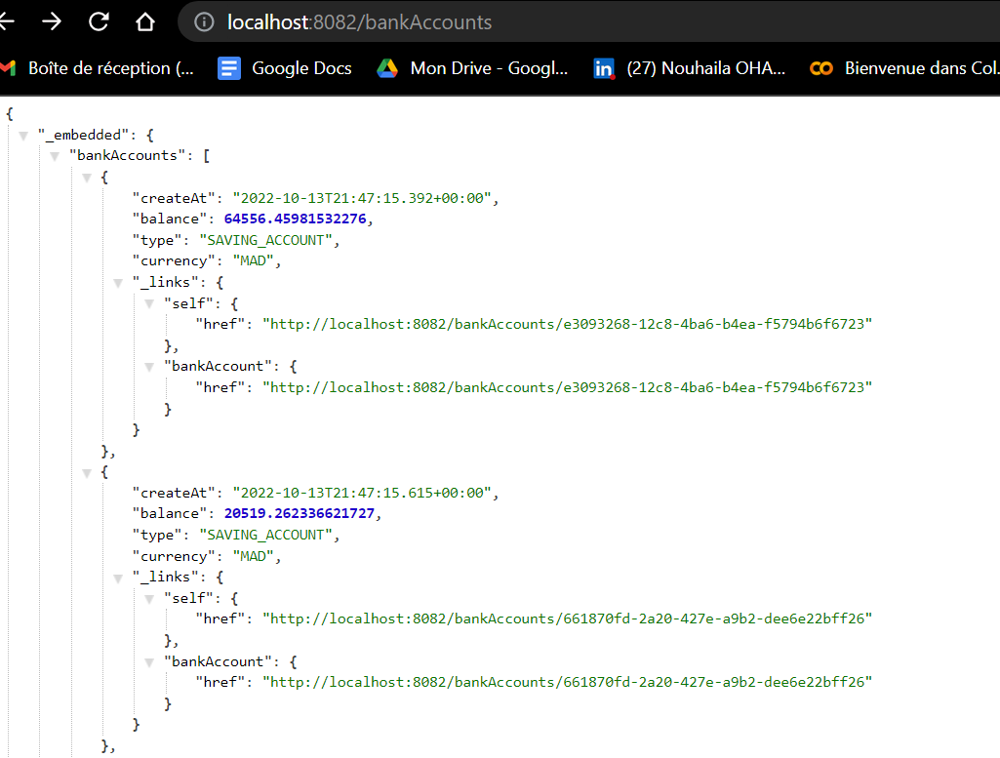

<title> Création d'un microservice avec sa documentation swagger</title>

###Les dépendances utlisées:
Spring web -> pour créer une application web spring MVC
Spring Data JPA-> il regroupe  : JPA , hebernate,spring data-> mapping des objets relationnels
h2 database-> création de la base des donnes  mémoire
lombok-> getters et setters
Rest Repositories->création web service

###Les dossiers nécessaires dans le projet:
entities--> class BankAccount
enums--> AccountType
repository --> BankAccountRepository
web-->bankAccountRestController( Mapping)

##Résultats:
Il y a 2 méthodes pour créer un web service :
Utilisation de Spring data rest (@RepositoryRestResource) pour les traitements simples (CRUD operations)
Pour afficher le fichier JSON , on écrit :http://localhost:8082/bankAccounts

ou
Un restController (@RestController)
pour les traitements complexes qui font l'appel a la couche service
Pour afficher le fichier JSON, on écrit :http://localhost:8082/api/bankAccounts

