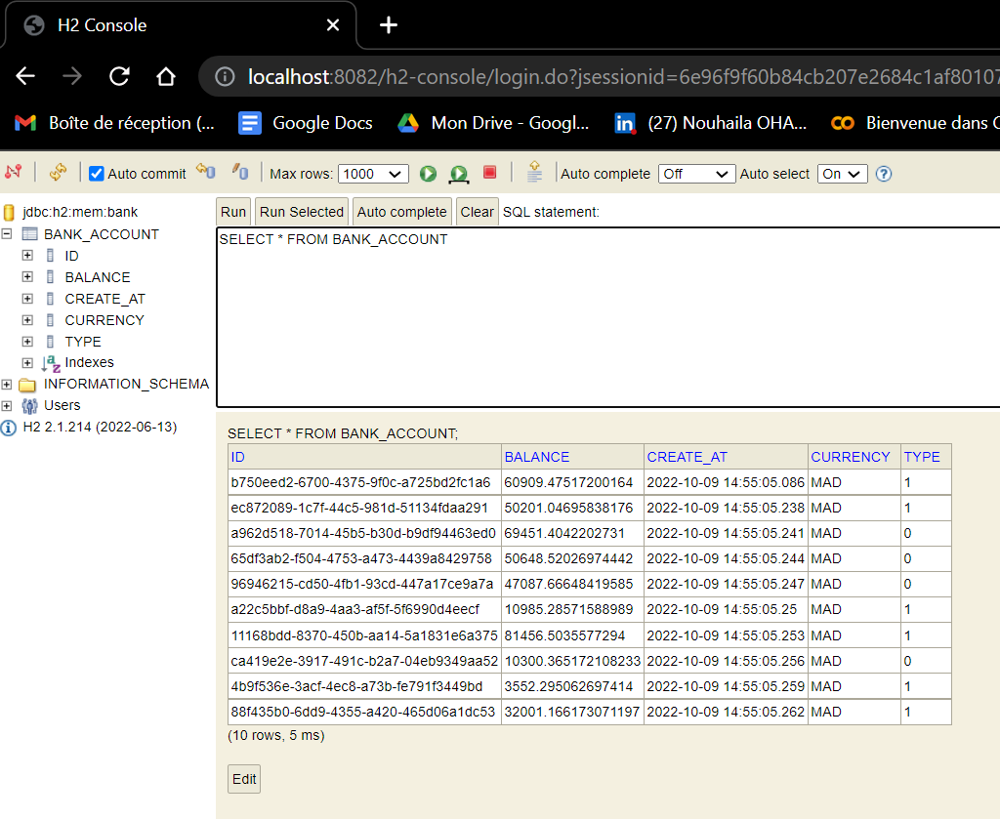
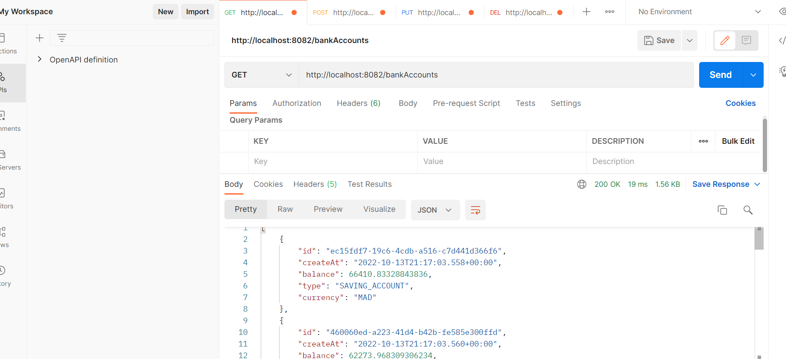
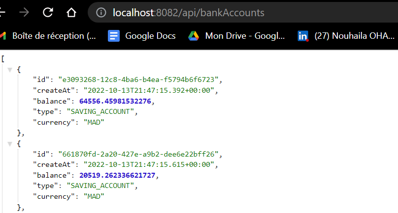
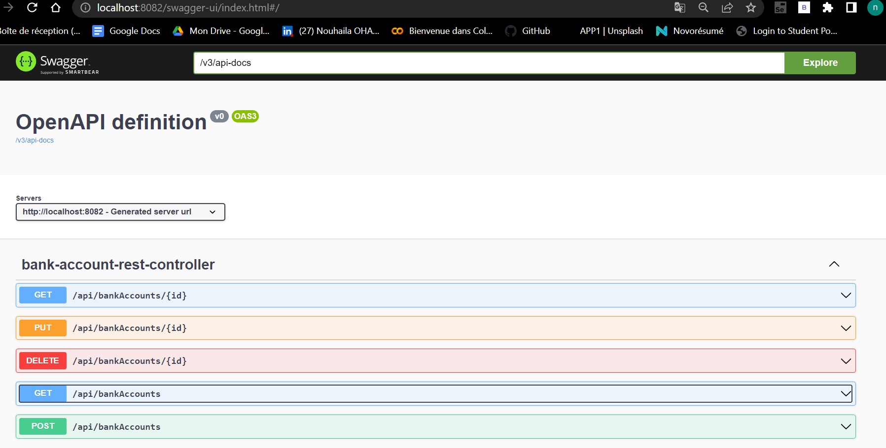

<h1>Création d'un microservice avec sa documentation swagger</h1>

<h2>Les dépendances utlisées:</h2>
Spring web -> pour créer une application web spring MVC  
Spring Data JPA-> il regroupe  : JPA , hebernate,spring data-> mapping des objets relationnels  
h2 database-> création de la base des donnes  mémoire  
lombok-> getters et setters  
Rest Repositories->création web service  

<h2>Les dossiers nécessaires dans le projet:</h2>
entities--> class BankAccount  
enums--> AccountType  
repository --> BankAccountRepository  
web-->bankAccountRestController( Mapping)  

<h2>Résultats:</h2>
On peut voir la base des données sur l'interface web 'h2 console'   
  
Et pour tester le fichier JSON (avec CRUD OPERATIONS) , on a utilisé en premier 'postman'   
  

Il y a 2 méthodes pour créer un web service :  
Utilisation de Spring data rest (@RepositoryRestResource) pour les traitements simples (CRUD operations)  
Pour afficher le fichier JSON , on écrit :http://localhost:8082/bankAccounts   
  
ou  
Un restController (@RestController)  
pour les traitements complexes qui font l'appel a la couche service  
Pour afficher le fichier JSON, on écrit :http://localhost:8082/api/bankAccounts   
  
 
<h3> Swagger</h3>
Pour les API restul ,il faut créer la docummentation 'swagger'  
en ajoutant la dépendance : spring boot openapi maven dependency  
(SpringDoc OpenAPI UI » 1.6.11)   
  
<b>Important:</b>
http://localhost:8082/v3/api-docs : documentation de l'api .
On peut l'importer dans 'postman' pour avoir tous les méthodes réalisées.